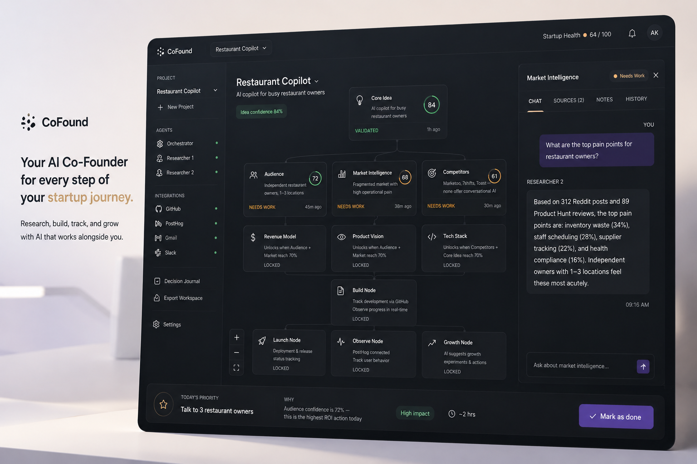

# cofounder

startup os in a browser — drop an idea, get a living graph, agents do the annoying research bits

your startup becomes an **11-node knowledge graph**. one orchestrator runs the show, researchers fill the nodes, sse streams the chaos live, and you get one clear **today's priority** when you need to actually do something

**live** → [cofounder-alpha.vercel.app](https://cofounder-alpha.vercel.app)  
**repo** → [github.com/nothariharan/CoFound](https://github.com/nothariharan/CoFound)

---

## what you get

- **canvas** — react flow graph w/ confidence rings, unlock logic, agent chips on each node
- **research agents** — spawn on canonical nodes or spin up custom research nodes on demand
- **voice orb** — talk or type to spawn research, pivot, export, hand off priorities
- **live feed** — sse pushes agent lines + graph updates while stuff runs
- **surgical pivot** — diff classifier only resets nodes that actually changed
- **integrations** — github for build signals, posthog for funnel drops, reddit + web for market evidence
- **export** — scaffold zip when revenue + product + tech are ready (readme, stack, ui spec, project rules, handoff)

---

## stack (the boring but important bit)

| thing | what it does here |
|-------|-------------------|
| mongodb atlas | direct graph, task queue, journal, event, and knowledge storage |
| gemini 2.5 pro | orchestrator, dialogue, pivot classifier, export narrative |
| gemini flash | researcher loops + critique scoring |
| lightweight planner | breaks workspace context into focused research tasks |
| firecrawl + web + reddit | market + community evidence without a browser process |
| deepgram (opt) | voice stt/tts through backend proxy |

ping it when backend is up:

```bash
curl http://localhost:8000/health
```

happy path looks like:

```json
{"status":"ok","store":"atlas","python":"3.11.9"}
```

spawn research and watch the feed for planner and researcher activity

---

## run it locally

**deps**

- python 3.11+ (3.13 local pytest might cry, prod uses 3.11)
- node 20+
- atlas cluster
- [google ai studio key](https://aistudio.google.com/app/apikey)

**backend**

```bash
cd backend
python -m venv .venv
.venv\Scripts\activate        # windows
# source .venv/bin/activate   # mac/linux
pip install -r requirements-dev.txt
uvicorn main:app --reload --port 8000
```

**frontend**

```bash
cd frontend
npm install
npm run dev
```

→ [localhost:5173](http://localhost:5173) — type an idea, you're in

**docker** (if you hate manual setup)

```bash
cp .env.example .env
docker compose up
```

---

## env

copy `.env.example` → `.env` at repo root

| var | req | notes |
|-----|-----|-------|
| `MONGODB_URI` | y | atlas for all persistent application data |
| `GOOGLE_API_KEY` | y | gemini agents and planner |
| `GEMINI_PRO_MODEL` | n | default `gemini-2.5-pro` |
| `FIRECRAWL_API_KEY` | n | web research |
| `REDDIT_CLIENT_ID` / `SECRET` | n | community research |
| `DEEPGRAM_API_KEY` | n | voice |
| `GITHUB_TOKEN` | n | build node |
| `POSTHOG_API_KEY` | n | observe node |
| `CORS_ORIGINS` | n | comma sep, include your vercel url in prod |

run uvicorn from repo root so `main.py` picks up root `.env`

---

## how it flows

```
idea → orchestrator → planner → researchers → mongodb graph
           ↓                              ↓
    voice / chat ui                  sse → frontend
           ↓
    today's priority
```

deeper docs → [architecture](docs/architecture.md) · [mongodb schema](docs/mongodb_schema.md)

All API and agent operations share one direct async MongoDB store.

**key routes**

| method | path | vibe |
|--------|------|------|
| `POST` | `/api/workspace` | create graph from idea |
| `GET` | `/api/workspace/{id}` | full graph |
| `POST` | `/api/orchestrator/chat` | talk to the orb |
| `POST` | `/api/agents/spawn` | bulk research session |
| `POST` | `/api/agents/spawn-research-agents` | custom nodes + parallel agents |
| `GET` | `/api/feed` | sse stream |
| `POST` | `/api/voice/stt` · `/tts` | voice proxy |

---

## folder map

```
cofounder/
├── backend/
│   ├── main.py          # fastapi entry, store bootstrap
│   ├── api/             # routes (workspace, agents, feed, voice, export)
│   ├── agents/          # orchestrator, researcher, planner, growth, etc
│   └── tools/           # firecrawl, web, github, posthog, deepgram
├── frontend/            # vite + react + react flow
├── docs/                # architecture + schema
└── scripts/             # atlas seed + indexes
```

---

## prod deploy

- **frontend** → vercel (`frontend/vercel.json`)
- **backend** → render (`render.yaml`, python 3.11)
- set `VITE_API_BASE_URL` on vercel to your render api url
- set `CORS_ORIGINS` on render to your vercel domain

---

## license

mit — [LICENSE](LICENSE)
